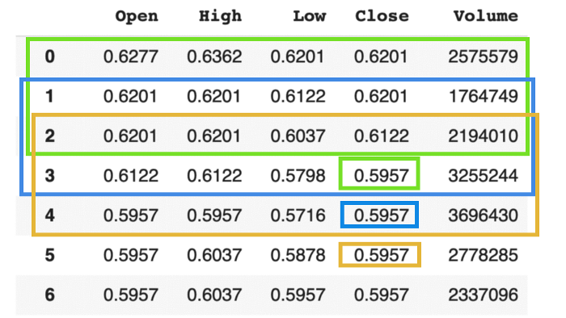

Data fuels the modern world. Large corporations, from Facebook to Google, rely on the data of individuals to understand and target consumers and users in the cloud. The majority of data processing is done with computers, afterall, computers are exceptional at data analysis; they can analyze thousands of  pieces of data in an instant, draw conclusions, find patterns, extrapolate, and predict. The methods by which this is done has advanced over the decades—manual and repetitive input and analysis of data have been replaced by machine learning models capable of much more. 

In this project, we wanted to explore the ways we could use a machine learning model to make predictions about a specific stock, in this case Microsoft. 

# Content
- [Initial Problem](#initial-problem)
- [The Model](#the-model)
- [Datasets](#datasets)
- [Results](#results)
- [Conclusions](#conclusions)
- [Moving Forward](#moving-forward)
- [Citations](#citations)

## Initial Problem

The question we wish to answer is very simple: can we predict day-to-day opening prices for Microsoft's stock. 

## The Model

There are countless machine learning models, each with its own pros and cons. We decided to go with a model known as Long Short-Term Memory (LSTM), a type of Recurrent Neural Network (RNN). Why this model? For several reasons.

1. The point of a stock analysis is to use trends in the data to predict future prices. A model that is incapable of taking into account past data (such as in the past 10, 15, or 30 days) is useless to us. Past data is key here. 

2. LSTM models give us a simple way to process entire sequences of data (also known as time series data) and lets us extrapolate the following day(s).

3. Vanilla RNN’s have a problem with a vanishing gradient, in other words the learning completely dissipates as the data reaches the end of the neural network. LSTM’s deal with this problem effectively by adding a unique additive gradient structure. 

### Understanding Time Series

(Image from: [towardsdatascience.com](https://towardsdatascience.com/predicting-stock-price-with-lstm-13af86a74944)

Suppose we want to use a machine learning model to predict the temperature tomorrow. When we train our model, we want it to make predictions based off of three days prior. For example, if I want to know what the temperature will be on the 15th of this month, and I have the temperature for every day this month, I only want to use the temperature from the 12th, 13th, and 14th to make a prediction of the temperature on the 13th. This 3 day interval is what is known as the time step. We could get this model to predict the temperature over however many days we prefer but after a couple days it becomes random guessing. Suppose we wanted to use three days of temperatures to calculate the next three days. Temperatures from 12th, 13th, and 14th would be used to predict the temperature on the 15th. Then the data would shift one day over to predict the temperature on the 16th (Shift from 12th, 13th, 14th to 13th, 14th, and predicted 15th). It would do this predicting and shifting for however many days we specify. 

It’s essentially the same idea when it comes to predicting the price of stocks with different values. Our time step was 150 days, and we wanted to predict 30 days into the future. 

## Datasets

The data we use is fairly straightforward. Our main dataset is the opening price of Microsoft's stock from 1986 to 2017 from Kaggle. This gives us thousands of data points to work with. Our secondary datasets were the monthly unemployment rates and housing starts over the same period of time as the stock. Since Microsoft's stock is traded nearly every weekday of the year, it was necessary to interpolate the unemployment or housing starts on a given day in the month. 

For this project, we trained three separate models, each trained on different sets of data. Our first model was trained using only the opening prices, the second model was trained with opening prices and unemployment, and the third model was trained with the prior two datasets as well as housing starts.

## Results

Before we jump right into the results, we think it’s best to clarify how we measured how well our models were predicting. We used a commonly used statistical measure of error known as root-mean-squared error (RMSE). RMSE is a measure of the differences between values predicted by a model and the values observed. So, in our case, we measured the difference between 30 predicted days by our model and real data from our large dataset (data that we didn’t train the model on). We compared this error to the error we presumed a human could get with basic guessing. Let’s say someone keeps guessing that tomorrow’s stock price will be the same as today, and they keep doing this over the course of the 30 day time period. This would produce an error that we could also apply RMSE to. This is what we called the ‘base error’ and it acted as a sort of benchmark. This is how each of our models performed:

## Conclusions

<b>Model 1: Microsoft’s stock</b>

Our first model was trained solely on Microsoft’s opening stock value over time. We realized this model when trying to make predictions was doing nothing more than blind guessing. Well, it’s a little more complicated than that. We think the model could pick up certain trends but they were meaningless to the data as a whole. That’s why, when we saw a spike or a dip in the stock value, there was a free ‘fall’ in either direction; the model simply had no reason to believe things were getting better or worse. 

<b>Model 2: Microsoft’s stock and Unemployment</b>

Our second model performed reasonably well! This is because unlike the previous model, there’s not one piece of data to be understood and therefore it’s not just random guessing. Economists know that unemployment and the stock market as a whole are very well interconnected and one can indicate the status of the other. 

<b>Model 3: Microsoft’s stock, Unemployment, and Housing Starts</b>

There are 2 possible conclusions that can be drawn from this. The first is that the weights of the housing data are off. I think this is more reasonable because economists generally agree that housing starts are a good indicator of the stock market as a whole. The second possible conclusion is that housing starts just isn’t a good indicator and Microsoft is unaffected by the housing market. 

## Moving Forward
There are many different directions we could take this project in the future. We still aren’t very satisfied with the accuracy of our predictions. There are many ways we can go about tweaking the accuracy, though all involve trial and error:

The first thing we thought about trying was using a different company’s stock. Under our current models, the predictions didn’t seem to pick up on patterns in the opening prices. The model performed very well when it came to predicting the training data, but when it came to predicting new data, it performed poorly. We think this happens because Microsoft stock is too volatile and unpredictable—there are no repeating patterns in the long-term. Perhaps a different company’s stock, specifically one outside the tech industry, would react differently to certain indicators and in turn become more predictable. Or, instead of just using one stock’s price, we use multiple and see if our model can pick up on trends between both sets of data.
  
Regardless of which stock we choose to continue this project with, there are many changes we can make within the model itself. As discussed in our conclusions, the third model (opening, unemployment, and housing starts) performed worse than we expected. In this case, adding more data didn’t help with our predictions at all. Maybe the housing starts data wasn’t completely invaluable but rather it could have had its weight tweaked a little bit. By tweaking the importance of unemployment, housing starts, or future datasets relative to the opening data, we could probably hone in on a more accurate model. The problem with that is our lack of GPU power and ability to train this type of model in a short amount of time (each train took about an hour each).
  
Lastly, we could look into using a multivariate LSTM model which is designed for multiple input series. In this project, the way we got our data into a usable form was by taking a bunch of lists of the 3 element triplets (opening, unemployment, housing starts) and then ‘flattening’ them into one larger list of those elements. This method is probably very inefficient and could have made our predictions less accurate, depending on how the computer interpreted the data. With a multivariate LSTM model, we can feed the data in parallel which could allow for better predictions of all three variables.

## Citations

In this project, we gathered data and code from a variety of sources. Our large set of opening data was taken from:

[Huge Stock Market Dataset](https://www.kaggle.com/borismarjanovic/price-volume-data-for-all-us-stocks-etfs)

Our set of monthly unemployment rates was taken from:

[US Monthly Unemployment Rate 1948 - Present](https://www.kaggle.com/tunguz/us-monthly-unemployment-rate-1948-present)

Our set of monthly housing starts was taken from:

[Housing Starts: Total: New Privately Owned Housing Units Started](https://fred.stlouisfed.org/series/HOUST)

And lastly, many of the functions of our code was adapted from:

[https://github.com/krishnaik06/Stock-MArket-Forecasting](https://github.com/krishnaik06/Stock-MArket-Forecasting)

